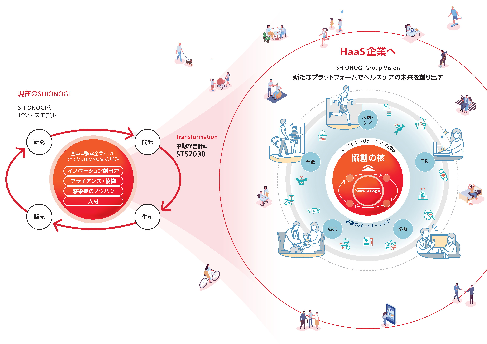

# データサイエンス部について

私たちデータサイエンス部は、"新たなプラットフォームでヘルスケアの未来を創り出す" というSHIONOGIの2030年ビジョン達成に向けて、2020年4月に発足したヘルスケア戦略本部の傘下に、医薬開発本部 解析センターの一部機能独立により設立されたデータサイエンス室が起源です。

疾患の啓発・予防・診断・治療、および健康の維持・増進に対して、高度解析技術を駆使し、データに基づく戦略立案、推進に貢献してきました。

また、製品の研究・開発～市販後までの幅広いステージにおいて、統計およびデータサイエンスの側面から支援し、科学的根拠に基づく経営判断にも貢献してきました。

今後もこれらの貢献を続けながら、社内外の有用かつ多様なデータを収集するデータ活用基盤を構築していくため、そしてデータリテラシー向上のための人材育成施策を企画・推進していくため、データサイエンス室の機能・リソースを増強し、データサイエンス部として再編し、現在はDX推進本部の傘下に所属しています。

DX推進本部は、デジタル技術を用いたヘルスケアソリューションの創出とその実現を支えるデータ活用およびIT/セキュリティ基盤の構築を担う機能として2021年7月1日に新設されました。

## 社外発表実績

### 2024年度（予定含む）

#### 学会発表・講演

##### 人工知能学会　第37回全国大会

###### 企画セッション

- 『データエンジニアリングで育むデータの価値 ～データサイエンスを加速させる産学それぞれの視点～』 オーガナイザ（共同）

###### 一般セッション

- 『社会人女子ソフトボール選手を対象とした体調セルフチェックシステムの有用性の評価』
- 『感染症数理モデルを用いた定点当たり報告数に基づいたCOVID-19の流行予測』
- 『医薬品情報の検索に対応した文埋め込みモデルの構築と評価』
- 『事前学習と実臨床データを組み合わせた睡眠段階自動スコアリング精度改善技術の開発』

###### 企業ブース出展

- 『SHIONOGIのデータサイエンス部の活動内容ご紹介と採用イベント等のご案内』

###### SAS Innovate 2024 Las Vegas

- 『The Power of AI SAS Programmer: Pioneering Digital Transformation with AI, Data Science and SAS Viya』

### 2023年度

#### 学会発表・講演

##### SHIONOGI主催イベントSHIONOGI DATA SCIENCE FES 2024

- 『CNS 領域のトータルケアに向けたストレス予測アルゴリズム開発の取り組み』
- 『売上シミュレーションによる営業戦略の策定支援』
- 『感染症流行状況の把握と予測の取り組み』
- 『仮説検証サイクルを実現するデータサイエンティストとデータエンジニアの挑戦』
- 『SHIONOGI のデータ利活用基盤の現状と今後の展望』
- 『データサイエンス人材教育とデータサイエンス部保有スキルの見える化』
- 『オンデマンド計算環境の開発 -クラウド計算資源の効率的な利用と、高度解析の加速』
- 『データ活用を促進するデータカタログ』

##### 人工知能学会　第37回全国大会

###### 企画セッション：オープンサイエンス推進に向けた産学におけるデータマネジメントと利活用の取組と展望　オーガナイザ（共同）

- 『製薬企業におけるDX推進，データマネジメントの現状と今後の展望
- 『製薬企業におけるRWD利活用の現状とエビデンス構築事例の紹介』

###### 一般セッション：

- 『健康診断データを用いた因果探索手法の適用可能性検討』
- 『モンテカルロ法とベイズ推定を用いた経営リソースのシミュレーション』
- 『表情による感情推定AIモデルを用いた子供のオンラインコミュニケーションへの興味・集中を反映する客観的な評価指標の探索』
- 『勤怠データとウェアラブルデバイスを用いた個別最適モデルによる労働者のストレス予測』

##### 日本食品科学工学会 第70回記念大会

- シンポジウム：食の未来と科学技術の関わり－食料資源の持続的活用を目指して－
- 『健康診断データからみる食習慣とヘルスケア』

##### 第20回 DIA 日本年会2023:時空を超えた知と技の融合 ～Society 5.0～による医薬品開発の再構築

- 『製薬企業におけるRWD利活用の現状とエビデンス構築事例の紹介』

##### 日本計算機統計学会第37回シンポジウム

- 『逐次ベイズ推定を用いた経営リソースのモンテカルロシミュレーション』
- 『Spotfire・Python連携を用いたモンテカルロシミュレーションの可視化』

##### PharmaSUG SDE Japan 2023

- 『Generating Valuable Dummy Data for Analytical Method Development』
- 『人工知能解析プログラマ/DX推進サービス』（Sponsor Session）

##### 2023年度 日本分類学会シンポジウム

- 『異常検知手法による培養細胞画像のウイルス感染検出』

##### バイオベンチャーアライアンス主催 2023年度第2回ヘルスケア研究会

- 『SHIONOGIデータサイエンス部が描くデータ駆動型ヘルスケアの未来ーメンタルヘルスの事例から見えた期待と課題』

##### SCDM Japan Regional Conference 2023

- 『SHIONOGIにおける新たな統合解析環境構築』（SAS Institute Japan主催セッションへの企画協力）

##### 京都女子大学データサイエンス学部・研究所開設記念シンポジウム：データサイエンス教育の今、そしてこれから

- 『塩野義製薬 データサイエンス部の紹介、現地見学講義の実施報告』

##### 第18回日本統計学会春季集会

- 『欠測を伴う結果変数を考慮した因果推論における共変量バランスの検討』

##### データマネジメント2024

- 『塩野義製薬の成功事例から学ぶデータ活用による事業革新－ヘルスケア産業が目指す新たな価値づくり－』（共同発表）

##### 日本臨床試験学会第15回学術集会総会

- 『COVID-19パンデミック下における患者の受診動向調査』（共同研究）

##### 情報処理学会 第86回全国大会

- 『セルフヨガ実現に向けた骨格推定と呼吸波推定の活用検討』

#### セミナー

##### SHIONOGI Data Engineering Night Meeting

- 『SHIONOGIが考えるヘルスケア業界が求めるデータエンジニアとは』

##### SAS Institute Japan主催ラウンドテーブル：営業マーケティングDX成功の要因

- 『SHIONOGIにおける営業領域でのデータ活用事例』

##### SNOWFLAKE LEADERS ROUNDTABLE OSAKA

- 『SHIONOGI データサイエンス部の思考と実践』

##### SAS Evolves

- 『対談：トラディショナルなSAS9ユーザーがSAS Viyaを活用してどのようにDXストーリーを歩み始めたのか？』

##### Cloudera Evolves：DATA ANYWHERE,INNOVATION EVERYWHERE

- 『DX推進の要となるセントラルデータウェアハウスとデータマネジメントの取り組み』

##### SNOWFLAKE DATA CLOUD WORLD TOUR TOKYO

- 『SHIONOGI データサイエンス部が取り組む仮説検証サイクルの思考と実践、その環境構築』

##### ビジネス+IT主催　DX時代のデータ活用・分析2023夏:DXを加速するデータの民主化とその戦略

- 『データサイエンティストが創るビジネスとは？ーAI SAS Programmer の事例から学ぶー』

##### セミナー：製薬企業における リアルワールドデータ分析手順・性質・現実差異と 複数のデータベースの組み合わせ方法

- 『多様なデータベースの組み合わせによる価値創造　―エビデンス/ビジネス構築・経営活用―』

##### 日本経済新聞社主催　情報システム部門のための戦略的データマネジメント  データの民主化を実現するデータ分析・活用・連携とは

- 『ヘルスケア領域におけるデータエンジニアリング』

##### 製薬×データサイエンス Meetup 2023

- 『データサイエンスとヘルスケア – SHIONOGIによるウェアラブルデバイスを用いた近未来のストレス管理』

##### ビジネス+IT主催　DX & AI Forum 2024 Winter 大阪

- 『データサイエンティストによるビジネス創造の留意点と今後のAI技術への期待と課題』

##### セミナー：リアルワールドデータの製薬企業での活用事例と将来展望

- 『リアルワールドデータ利活用の実際と事例　～入門編～』

##### JBpress主催 2024 SPRING DX WEEK 第1回 データイノベーションフォーラム

- 『データに基づく仮説検証サイクルを実現するためのデータサイエンス機能のポイント』

#### 論文

- データサイエンティストのスキル要件と感染症領域におけるデータサイエンスの取り組み事例, PHARM STAGE（2023年4月号）

#### 論文(査読付)

- Wastewater-based reproduction numbers and projections of COVID-19 cases in multiple cities in Japan, Eurosurveillance (2024) (共同研究)
- Comparison of the incidence of severe outcomes in outpatients with COVID-19 or seasonal influenza without risk factors: Retrospective analysis of a health insurance claims-database, Journal of Clinical Virology Plus (2024) (共同研究)
- Virtual reality perceptual training can improve the temporal discrimination ability of swinging during softball batting, Front Sports Act Living (2024)（共同研究）

#### 特許出願中

- ヘルスケア関係 1件
- データベース基礎技術1件

他，外部発表，講演，投稿論文多数

### 2022年度

#### SHIONOGI主催イベント

##### SHIONOGI DATA SCIENCE FES 2023

- 『データサイエンティストが創るビジネス～AI SAS Programmerの事例から学ぶ～』
- 『デジタルデバイスを活用したうつ病の再燃予測の事例紹介』
- 『実ビジネスにおけるデータサイエンス人材教育の必要性と SHIONOGI での取り組み』
- 『SHIONOGI における次世代データマネジメント』
- 『ビジネス課題解決のためのデータ活用　～データ蓄積から分析・可視化まで～』
- 『VRデバイスを用いた無意識下におけるバッティング技術の向上～ソフトボールとヘルスケアの意外な繋がり～』
- 『データサイエンスを通した感染症への関わり方』

#### 学会発表・講演

##### 人工知能学会　第36回全国大会

- 『ライフログに基づく寛解期うつ病患者の抑うつ度予測に対するlightGBMの可能性について』
- 『ライフログからうつ病再発を予測するための機械学習アルゴリズムに関する予備検討』

##### 2022年度統計関連学会連合大会

- 『ノンパラメトリックアプローチを用いた行動ログの違いから見るうつ病再発』

##### CBI学会2022年大会

- 『塩野義製薬におけるデータサイエンス部の取り組みとデータ活用基盤』

##### PharmaSUG Japan 2021

- 『Building Business Intelligence Using Sales and Marketing Data and its Utilization』

##### 日本臨床試験学会第 14 回学術集会総会

- 『医療情報データから見る COVID-19 の影響調査』(共同研究)

#### セミナー

##### AWS Summit Online 2022

- 『塩野義製薬における IT 施策とデータ活用の融合と推進』

##### 製薬×データサイエンス Meetup 2022

- 『感染症領域におけるデータサイエンスの取り組み』

##### 製薬企業におけるリアルワールド活用・課題・実例　「データベース特性・解析」編

- 『多様なデータベースの組み合わせによる価値創造』

##### Cloudera Evolve 2022

- 『DX推進の要となるセントラルデータウェアハウスの進化と深化』

##### D-DRIVE データサイエンスセミナー

- 『SHIONOGIにおけるデータサイエンスの取り組み』

#### 論文(査読付)

- Determination of optimal prevention strategy for COVID-19 based on multi-agent simulation, Japanese Journal of Statistics and Data Science (2022)

#### 論文

- データ収集・集積のためのルール作りと周知徹底, PHARM STAGE（2022年12月号）

#### 特許出願中

- ヘルスケア関係 1件（共同研究）

他，外部発表，講演，投稿論文多数

### 2021年度

#### 学会発表・講演

##### SAS Global Forum 2021

- 『The Potential of Simulation Technologies : Multi Agent Simulation & Reinforcement Learning』

##### PharmaSUG 2021

- 『Why Data Scientists need leadership skills? Story of Cross-Value Chain Data Utilization Project』

##### PharmaSUG Japan 2021 Virtual Event

- 『Data Scientist in Shionogi : Education, Skills & Training』

##### 第41回医療情報学連合大会

- 『国内医薬品副作用データベースに対するネットワーク分析手法の適用可能性の研究』

##### 第41回医療情報学連合大会

- 『少数枚の医用画像による画像認識モデル構築方法の検討』

##### 第431回CBI学会講演会

- 『塩野義製薬におけるバリューチェーン横断型データ利活用について』

#### セミナー

##### PharmaSUG Japan 2021 Virtual Event

- 『データサイエンス入門～仮説思考の鍛錬～　ハンズオントレーニング講師』

##### AWS主催 関西地域におけるクラウド活用への挑戦

- 『塩野義製薬のDX推進におけるデータ利活用の現状と今後』

##### Cloudera Sessions 2021

- 『データレイクはDXの源泉となるのか？ バリューチェーン横断型データ利活用を考える』

##### 製薬業界のコマーシャル領域における国内外のAWS活用事例ご紹介

- 『塩野義製薬のDX推進におけるデータ利活用の現状と今後 コンテンツ追加版』

#### 論文(査読付)

- 医学研究に二次利用する医療情報データの特徴と性質を把握すべき意義, 日本臨床試験学会雑誌 (2022) [共同研究]
- Simplified Virtual Reality System Can Be Used to Evaluate the Temporal Discrimination Ability in Softball Batting as in the Real Environment, Front. Sports Act. Living (2022) [共同研究]

#### PCT国際出願中

- 人工知能解析プログラマシステム

他，外部発表，講演，投稿論文多数

### 2020年度

#### 学会発表・講演

##### 人工知能学会　第34回全国大会

- 『ウェアラブル端末データと欠測パターンからの行動リズムの考察』

##### 2020年度統計関連学会連合大会

- 『女子ソフトボール部スコアブックデータへの機械学習的アプローチ』

##### SAS Global Forum 2020

- Transfer Learning for Mining Digital Phenotype by SAS® Viya®

##### SAS Forum Japan 2020

- 医薬品・ヘルスケア業界におけるデータサイエンスと統合解析環境

##### PharmaSUG Japan 2020 Virtual Event

- Skill Building of Modeling & Simulation and its Applications

#### セミナー

- データサイエンスが拓く次世代R&D
- 医薬品・ヘルスケア業界におけるデータサイエンスと人工知能技術

#### 論文(査読付)

- Patient journey through cases of depression from claims database using machine learning algorithms, PLOS ONE (2021)
- Reconstructing the household transmission of influenza in the suburbs of Tokyo based on clinical cases, Theoretical Biology and Medical Modelling (2021) [共同研究]

#### 執筆活動

- 『リアルワールドデータの使用目的に応じた解析手法 -各データベースの選択と組み合わせ-』サイエンス＆テクノロジー（一部執筆）

#### 特許出願中

- 人工知能解析プログラマシステム

他，外部発表，講演，投稿論文多数